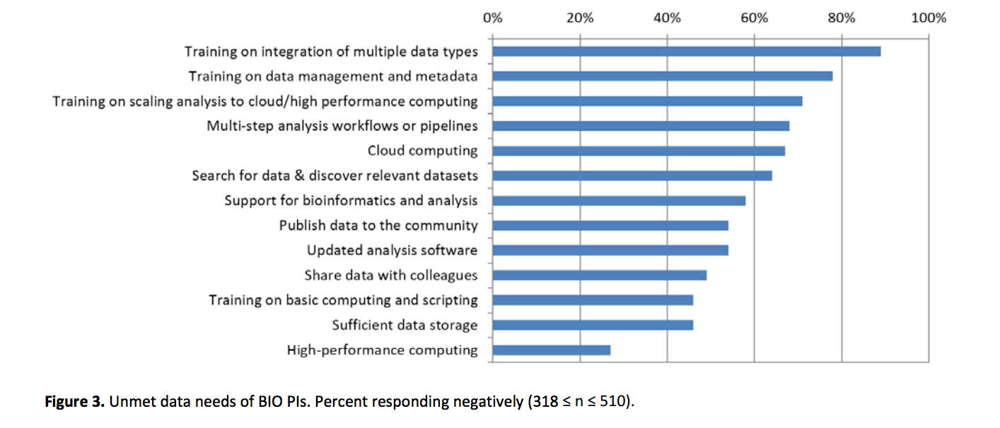
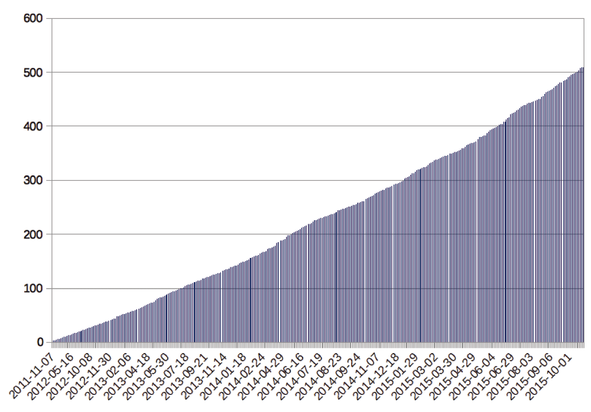
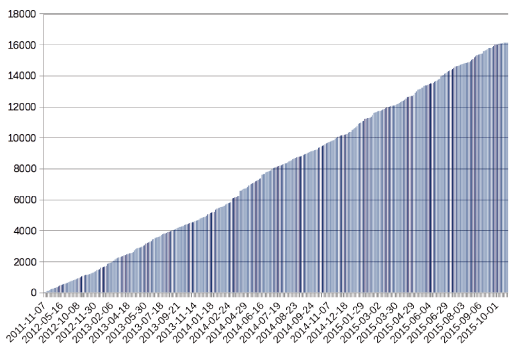
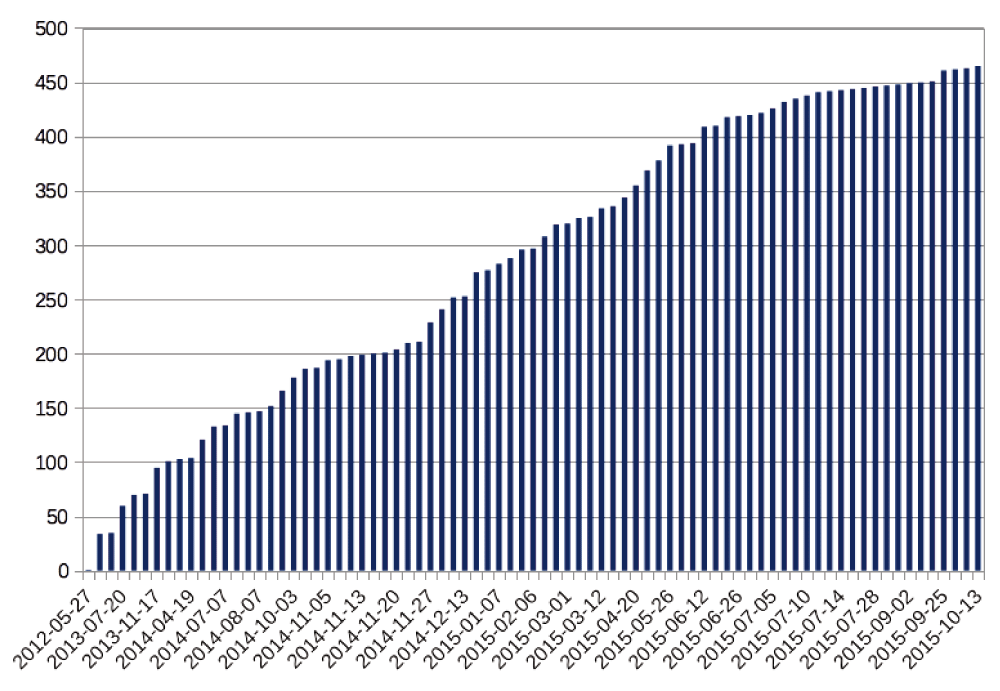

class: center, middle

# Software Carpentry
### and the democratization of data science
## Ariel Rokem
### The University of Washington eScience Institute

<small>Follow along at: <a href="https://arokem.github.io/2017-03-01-swc-dsswg">https://arokem.github.io/2017-03-01-swc-dsswg</small>

---

layout: true

<image src="images/escience-network.png" width=500px style="opacity:0.4;filter:alpha(opacity=40);"> 

---

# The context

["Unmet Needs for Analyzing Biological Big Data: A Survey of 704 NSF Principal Investigators"](http://biorxiv.org/content/early/2017/02/15/108555)

Barone, Williams, and Micklo

---

# Unmet needs

---

# Software Carpentry

--

- "Since 1998, Software Carpentry has been teaching researchers in science, engineering, medicine, and related disciplines the computing skills they need to get more done in less time and with less pain."

--

- Volunteer instructors.

--

- Democratically governed non-profit organization

--

- All the materials are freely reusable.

--

- Lessons are community developed.

---

# [The history](https://f1000research.com/articles/3-62/v2)

Greg Wilson and Brent Gorda started it in 1998. The first version was a week-long workshop held at LANL.

The program focuses on tools and techniques that are considered standard practice in the software industry:

--

- Version control

--

- Automation with the Unix shell  

--

- Data-base management (SQL)

--

- Programming (usually taught with high-level languages, Python or R)

---

## But it's not "Software Engineering"

"...careful documentation of requirements and lots of up-front design are not appropriate for people who (almost by definition) do not know what the right answer is yet..."

--

- Computer Science: this is basic material that is too easy to deserve a graduate credit.

- Other departments: courses like this ought to be offered by Computer Science departments.

---

# Further history

- In 2012, settled on the 2-day workshop format still used today.

- In 2014, joined NumFocus as a non-profit
  - Democratically elected steering committee
  - Managed as a distributed open-source <strike> software </strike> educational project

---

# Data Carpentry

- Also started in 2014.

- Focus is on data management and analysis.

---

# Number of workshops

---

# Number of learners

---

# Does it work?

Two separate assessments done in 2012 found:

- Participants computational understanding increased more than two-fold (as measured in test scores)

- Participants expressed high satisfaction (85% learned what they hoped to learn; 95% would recommend the workshop to others).

---

# An aspiration towards diversity

Workshops focused on women in science, engineering in medicine, since 2013

Other attempts focus on geographical diversity, with some limited reach in South
America, South Africa.

This is still a challenge

---

# Instructors as agents of change

- Instructor training program that follows the same pattern of the SWC workshops

- Two-day workshop, focused on topics from educational psychology and the unique instruction practices of SWC.

---

# We are legion

---

class: center
layout: false

### Stay in touch!

  
  
http://arokem.org
  

  
  
arokem@gmail.com
  

  
  
@arokem
  

  
  
github.com/arokem
  

